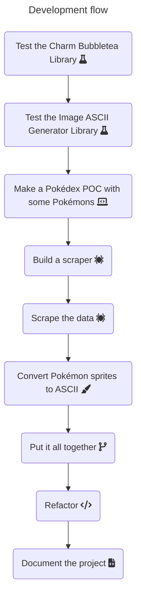

# Pokédex SH

[](https://golang.org/)
[](https://github.com/programacaoemacao/pokedex-sh/blob/main/LICENSE)


A Pokédex made in Golang using the [Charm BubbleTea](https://github.com/charmbracelet/bubbletea) to be used in the terminal, displaying information about Pokémon and their respective ASCII arts.

This repository has some bugs in the Pokémon visualization due to unknown causes.


## Running the Pokédex

You need to have [Golang >= 1.21](https://go.dev/doc/install) installed on your machine.

To run the Pokédex in your terminal, run this command:

> **Important**: It's highly recommended to run this repository using the VSCode intergrated terminal. It's going to show more accurate ASCII arts.


1. Install the dependencies
   ```bash
   make download-depedencies
   ```
1. Run the app
   ```bash
   make run-pokedex
   ```

If you don't have [Make](https://www.gnu.org/software/make/) installed, go to `Makefile` and copy the the commands corresponding to the desired command and execute them in the project root.

## Development flow



## Attention points

**You don't need to run the scraper and collect any data. The repository already contains the necessary data to run the Pokédex!**

If you would like to run the scraper, check this [page](https://github.com/programacaoemacao/pokedex-sh/tree/main/cmd/data_scraper).

If you would like to run the ASCII images generator, check this [page](https://github.com/programacaoemacao/pokedex-sh/tree/main/cmd/ascii_images_generator).