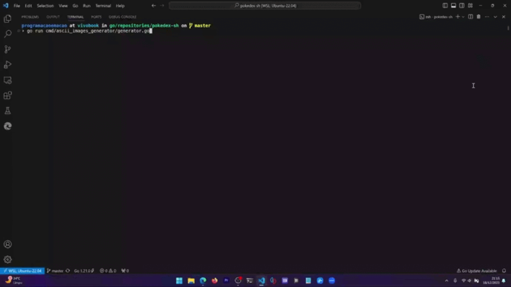

# ACSII images generator



Using the Pokémon scraped data, it's used the [ascii image converter](https://github.com/TheZoraiz/ascii-image-converter) to generate the ASCII arts.

All the ASCII images can be found at [pokemon_images.json](https://github.com/programacaoemacao/pokedex-sh/blob/main/pokemon_images.json) where each row represents an ASCII image.

The row at index 0 represents the Pokémon #1 (Bulbasaur), the row at index 1 represents the Pokémon #2 (Ivysaur), and so on...

## Running the app

Execute this command at repository root path:

```bash
make run-ascii-image-generator
```