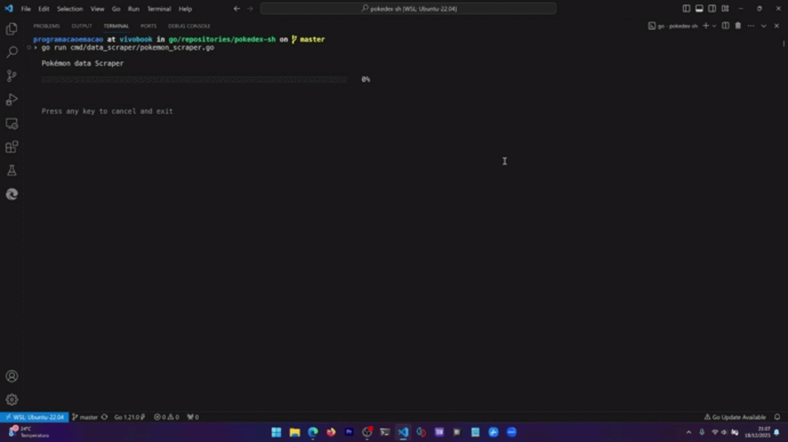

# Pokémon Scraper



The Pokémon data is scraped through [this website](https://sg.portal-pokemon.com/play/pokedex) using [Go Colly](https://github.com/gocolly/colly).

All the scraped data can be found at [pokemon_info.json](https://github.com/programacaoemacao/pokedex-sh/blob/main/pokemon_info.json).

The reason for using this website instead of the [PokéAPI](https://pokeapi.co/) is:
1. The PokéAPI doesn't have an image that can be used as an ASCII art in the terminal.
1. The PokéAPI doesn't provide the weaknesses of the Pokémon, so this field has to be generated.

**Important**: You don't need to run the scraper to run the Pokédex.

## Running the app

Execute this command at repository root path:

```bash
make run-data-scraper
```

**Attention**: This command can take some minutes to complete.